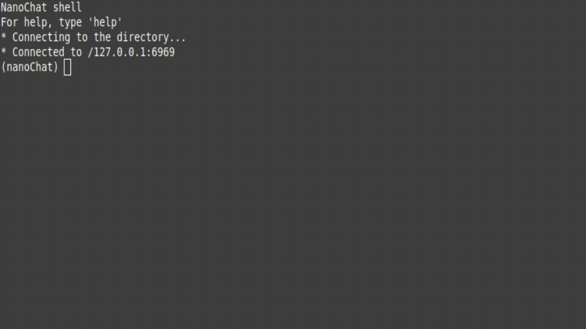

 

# Proyecto REDES
Proyecto de Redes de Comunicaciones para 2º de Ingenieria Informática.

Se trata de un minichat, modelo cliente-servidor, que permite crear chalas de chat entre usuarios.

Este proyecto ha sido realizado por Enrique Rodriguez Lopez y Víctor Emilio Vicente.

# Funcionamiento
Está formado por un servidor de chat, un conjunto de clientes que se conectarán a dicho chat y un servidor que funcionará como directorio. 

El servidor de chat debe registrarse primero en el servidor directorio para guardar en él su dirección de red, para que posteriormente los clientes puedan buscar en este los servidores de chat disponibles. Una vez conectados cliente y servidor, la comunicación será directa entre estos.


# Uso
Para poder hacer uso del programa, deberos de tener ejecutando como mínimo tres programas.

## Directorio

```console
enrique@pc:~$ java -jar Directorio.jar
```

## NanoChatServer

```console
enrique@pc:~$ java -jar Servidor.jar 127.0.0.1
```

## NanoChatClient

```console
enrique@pc:~$ java -jar Cliente.jar 127.0.0.1
```

Una vez esten los tres programas ejecutandose, podemos hacer uso de NanoChat.

La interacción con el programa la haremos con NanoChatCliente.


Este es el listado de comando que podemos ejecutar con NanoChat.

```console
(nanoChat) help

List of commands:
roomlist -- provides a list of available rooms to chat
enter -- enter a particular <room>
nick -- to set the <nickname> in the server
send -- to send a <message> in the chat
exit -- to leave the current room
info -- shows the information of the room
quit -- to quit the application
help -- shows this information
createroom -- create a new <room>
sendprivate -- to send a <message> to a <user> in the chat
rename -- to rename current room to <room>
sendfile -- to send a <file> to a <user> in the chat
confirm_file -- to confirm last file request received.
deny_file -- to deny last file request received.
```

Lo primero que debemos hacer será tener un nickname.

```console
(nanoChat) nick enrique

* Your nickname is now enrique
```
Con roomList podremos ver la lista de salas de chats disponibles en el servidior, por defecto habrá una.

```console
(nanoChat) roomlist

Room Name: RoomA	 Members (0) : 	Last message: not yet
```

Para entrar en la sala, usamos el comando enter.

```console
(nanoChat) enter RoomA

* ¡Estas dentro de la sala!
(nanoChat-room) 
```
Veremos que nuestro estado cambia a (nanoChat-room), ahora podremos enviar mensajes en dicha sala y si hay más usuarios conectados los recibirán.

```console
(nanoChat-room) send hola
(nanoChat-room) enrique: hola
(nanoChat-room) send mundo
(nanoChat-room) enrique: mundo
```

# Demo

 
